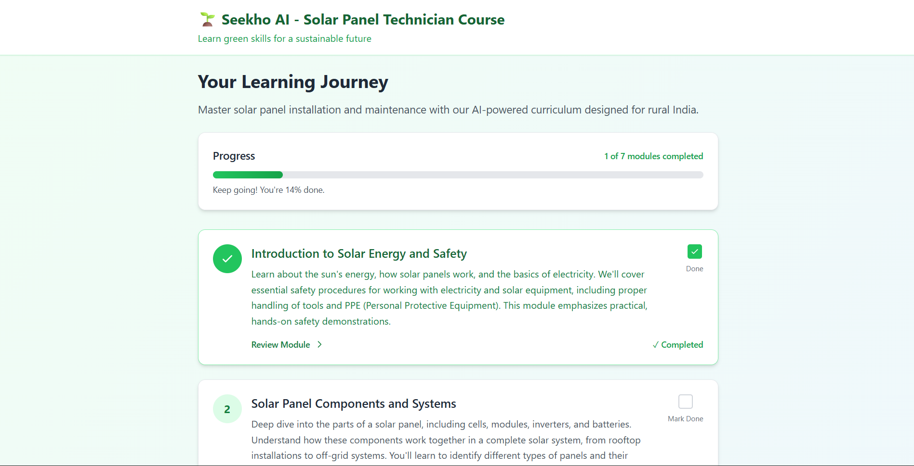
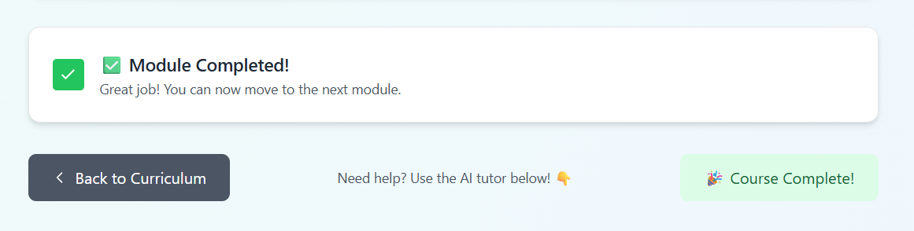
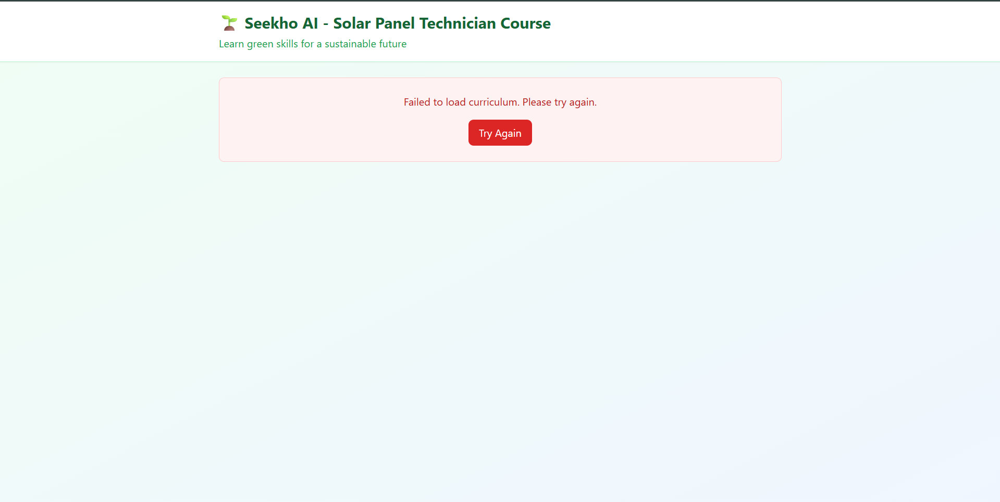
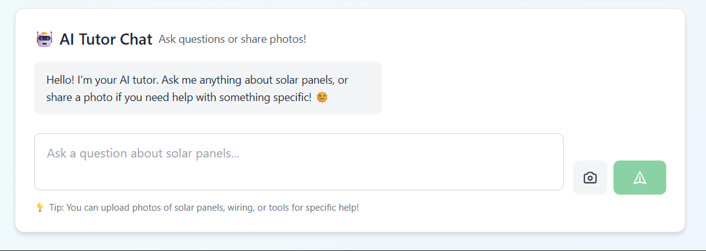
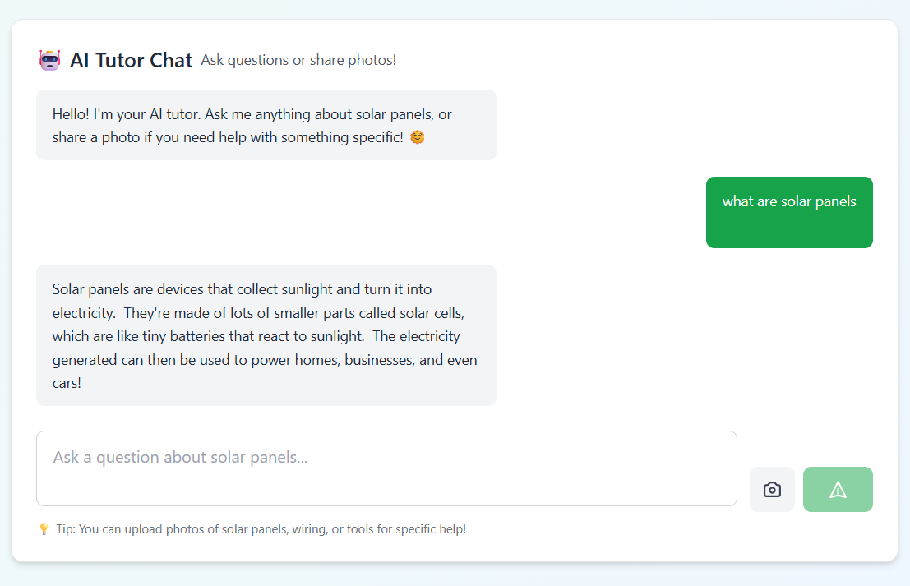

# 🌱 Seekho AI - Solar Panel Technician Course

**Seekho AI** is a mobile-first web application that provides **personalized, AI-generated learning paths for green skills in rural India**.  
This prototype focuses on one key course: **Solar Panel Technician**, designed to empower rural youth with practical and sustainable skills.

---

## 🚀 Project Overview
- **Backend**: Python (FastAPI) with Google Gemini API integration.
- **Frontend**: React + Vite + Tailwind CSS.
- **AI-powered features**:
  - Dynamic curriculum generation.
  - Interactive lesson content in simple, rural-friendly language.
  - An AI tutor that can handle text and image-based queries.

---

## ✨ Key Features
1. **AI-Generated Curriculum**
   - 7-module structured course generated by Gemini AI.
   - Simple, practical, and encouraging content for rural learners.

2. **Lesson Pages**
   - Each module expands into detailed lesson content.
   - Lessons are explained with analogies relevant to village life.
   - Rendered in **Markdown** for readability.

3. **AI Tutor (Chat with Image Support)**
   - Students can ask text-based questions or upload an image.
   - The AI tutor analyzes questions/images and responds clearly.
   - Prioritizes **safety and encouragement**.

4. **Mobile-First Design**
   - Built with **React + Tailwind CSS**.
   - Lightweight and accessible for rural users.

---

## 🛠️ Tech Stack
- **Backend**: FastAPI, Pydantic, Uvicorn, Google Generative AI
- **Frontend**: React, Vite, Tailwind CSS, Axios, React Router, React Markdown
- **Other Tools**: dotenv for secrets, python-multipart for file uploads

---

## 📂 Project Structure
-- SeekhoAI/
-- │── backend/
-- │ ├── main.py
-- │ ├── requirements.txt
-- │ ├── .env.example
-- │
-- │── frontend/
-- │ ├── package.json
-- │ ├── src/
-- │ │ ├── components/
-- │ │ │ ├── CurriculumPage.js
-- │ │ │ ├── LessonPage.js
-- │ │ │ ├── TutorChat.js
-- │ │ ├── App.jsx
-- │ │ ├── main.jsx
-- │
-- └── README.md

---


---

## ⚙️ Setup Instructions

### 1️⃣ Backend Setup (FastAPI)
```bash
cd backend
python -m venv venv
source venv/bin/activate   # on Windows: venv\Scripts\activate
pip install -r requirements.txt
cp .env.example .env
# Add your GEMINI_API_KEY in .env
uvicorn main:app --reload --port 8002
```
---

### 2️⃣ Frontend Setup (React + Vite)
```bash
cd frontend
npm install
npm run dev
```
---

🔮 Future Enhancements

-- Multi-course support (Electrician, Organic Farming, etc.)

-- Offline-first mobile app (PWA).

-- Local language translation for broader accessibility.

-- Gamification (badges, quizzes, progress tracking).

---



---



---



---



---




